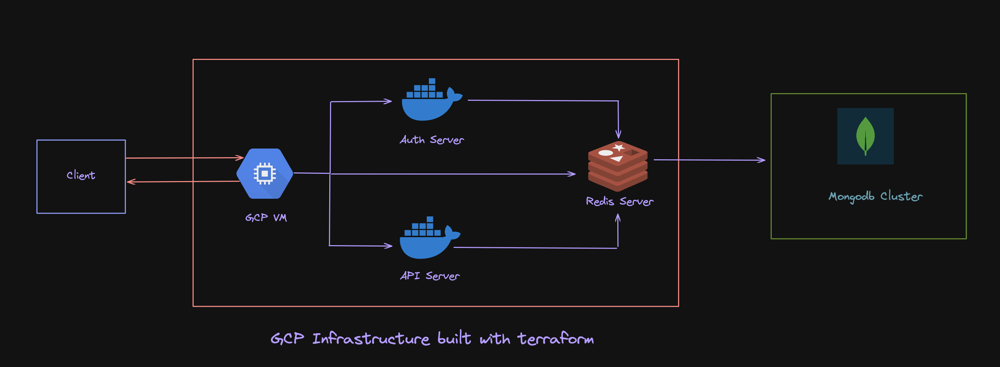

  
  
  
  
  
  
  

# PortfolioCMS

A Headless CMS built with Express,Typescript and MongoDB

## Architecture:
The infra for PortfolioCMS is built with `Terraform` and `GCP` alongside `Docker` containers for each service
Here is a brief overview of it:

## Install and Run:
Docker is the most convenient way to build and run `PortfolioCMS`
To install and run using docker, run docker-compose:

> In Development Mode:

    docker-compose -f docker-compose.dev.yml up -d --build

> Using Makefile with `docker-compose v1`:

    make compose_dev_up_v1

> Using Makefile with `docker compose v2`:

    make compose_dev_up_v2

## Environment
PortfolioCMS supports the following environments:

- local

- dev

- prod
